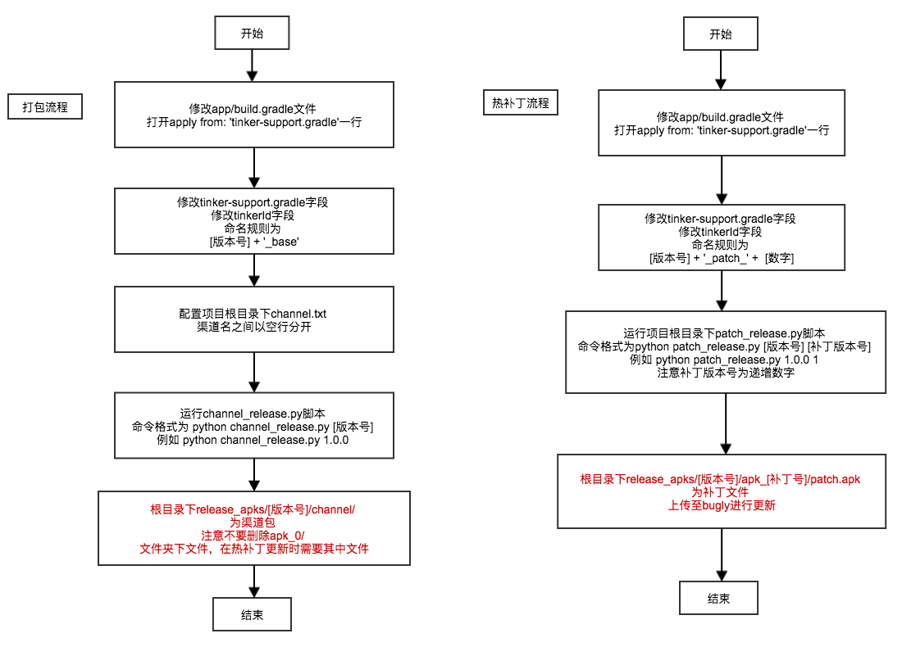

## 项目相关

### 一、编码规范
#### java相关
* 项目以业务模块分包，不允许出现不同功能模块的文件错位
* 驼峰命名法
* Activity文件以Activity结尾，Fragment，Adapter等依次类推
* 运算符两边必须加空格比如‘int a = 1;’
* 分隔符后必须加空格比如‘{a, b, c}’
* java代码中不允许出现中文字符串，必须在strings.xml中定义

#### xml相关
* 文件命名：列表以list_打头 activity以activity_打头 fragment以fragment_打头
其他布局以layout_打头
* id命名： TextView以tv_打头 ImageView以img_打头 其他layout都以layout_打头
其他特殊布局或特殊控件比如PullRefreshView，以prv打头，以此类推
* xml代码中不允许出现中文字符串，必须在strings.xml中定义

#### 文件位置
* 所有图片资源放在mipmap文件夹下，生成hdpi,xhdpi,xxhdpi三种规格，不允许放入drawable文件夹下（使用项目下Resizer-1.4.1.jar生成图片）
* 图片命名尽量不使用数字标记

### 二、Third Library
#### 安居客android架构：https://github.com/BaronZ88/MinimalistWeather
* 在该框架上进行修改，抛弃了dagger2的依赖注入框架
* 注意mvp设计模式的编码规范，不允许出现不同层级工作任务混淆的问题

#### 沉浸式状态栏 https://github.com/jgilfelt/SystemBarTint
* 注意style项目主题的设置

#### 动态权限管理 https://github.com/hongyangAndroid/MPermissions
* 注意manifest中的权限申请，否则不会调用解释方法
* 不能在library中引用库，否则会出现运行时错误

#### MaterialDialog弹框 https://github.com/drakeet/MaterialDialog

### 三、账号相关

### 四、必读文章

1. [Android性能优化典范 - 第1季](http://hukai.me/android-performance-patterns/)
2. [Android性能优化典范 - 第2季](http://hukai.me/android-performance-patterns-season-2/)
3. [Android性能优化典范 - 第3季](http://hukai.me/android-performance-patterns-season-3/)
4. [Android性能优化典范 - 第4季](http://hukai.me/android-performance-patterns-season-4/)
5. [Android性能优化典范 - 第5季](http://hukai.me/android-performance-patterns-season-5/)
6. [Android内存优化之OOM](http://hukai.me/android-performance-oom/)
7. [Android开发最佳实践](http://hukai.me/android-dev-patterns/)
8. [Android性能优化之渲染篇](http://hukai.me/android-performance-render/)
9. [Android性能优化之运算篇](http://hukai.me/android-performance-compute/)
10. [Android性能优化之内存篇](http://hukai.me/android-performance-memory/)
11. [Android性能优化之电量篇](http://hukai.me/android-performance-battery/)
12. [Android Training - 管理应用的内存](http://hukai.me/android-training-managing_your_app_memory/)
13. [Android Training - 提升布局文件的性能(Lesson 1 - 优化布局的层级)](http://hukai.me/android-training-improve-layouts-lesson-1/)
14. [Android Training - 提升布局文件的性能(Lesson 2 - 使用include标签重用Layout)](http://hukai.me/android-training-improve-layouts-lesson-2/)
15. [Android Training - 提升布局文件的性能(Lesson 3 - 使用viewStub按需载入视图)](http://hukai.me/android-training-improve-layouts-lesson-3/)
16. [Android Training - 提升布局文件的性能(Lesson 4 - 使用ViewHolder来提升ListView的性能)](http://hukai.me/android-training-improve-layouts-lesson-4/)
17. [对于开发者来说，Android 的开发者选项里有哪些实用的功能？](https://www.zhihu.com/question/29967530)
18. [Android内存溢出分析](http://blog.tisa007.com/tech/android_memory_management_and_solve_oom_problem.html)
19. [Android开发经验总结](http://zmywly8866.github.io/2015/12/12/android-develop-experencies.html)

### 五、版本更新和热更新流程

